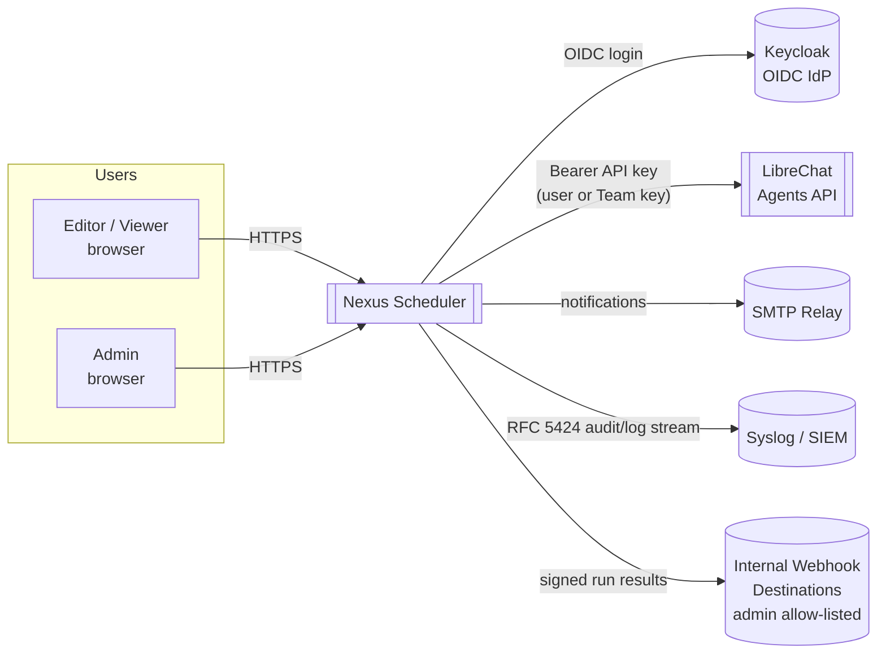
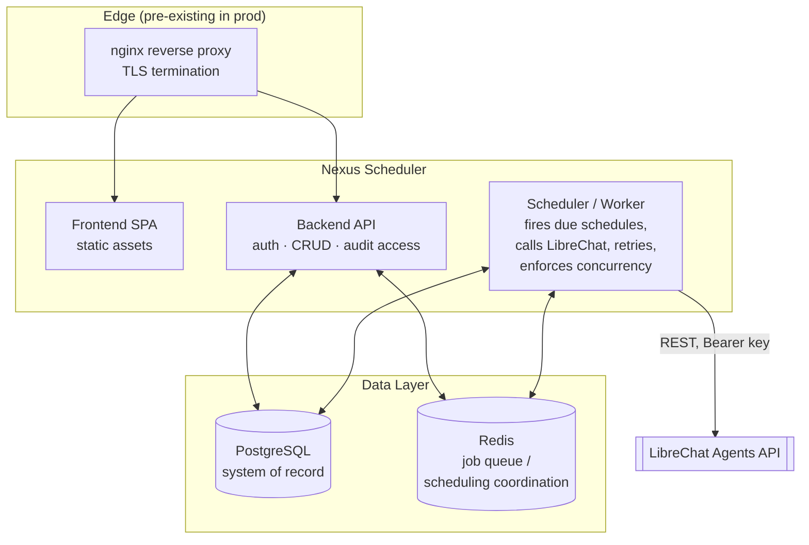
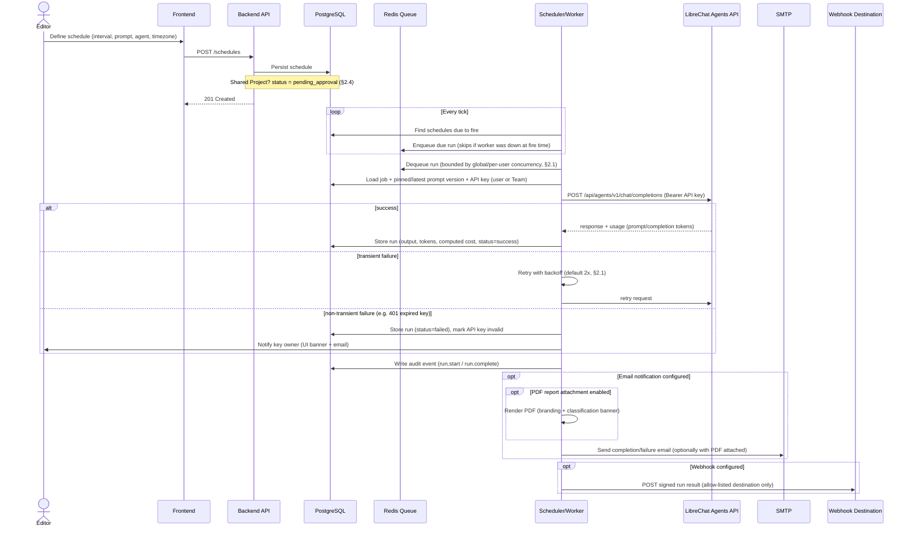
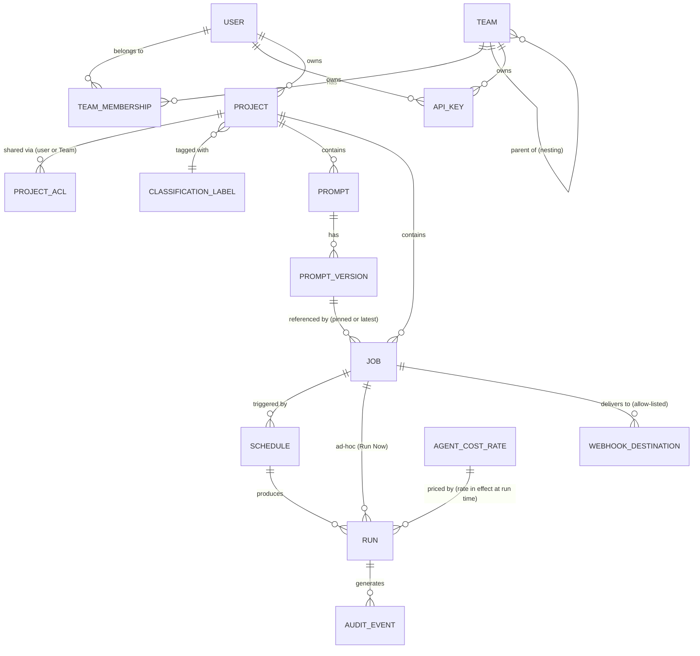
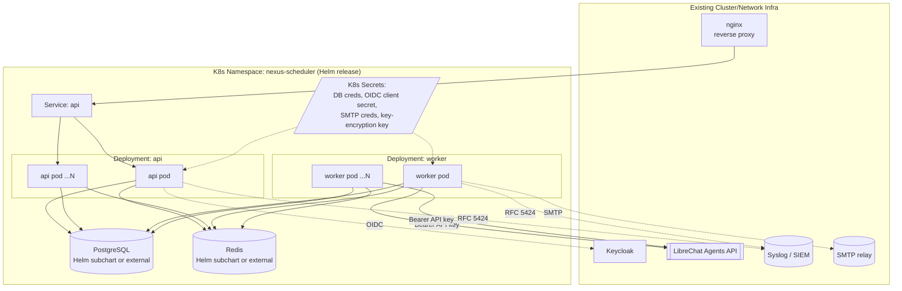
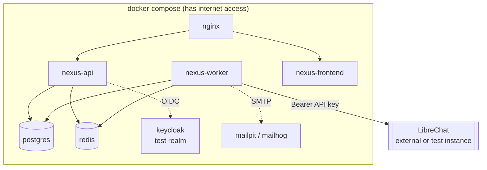
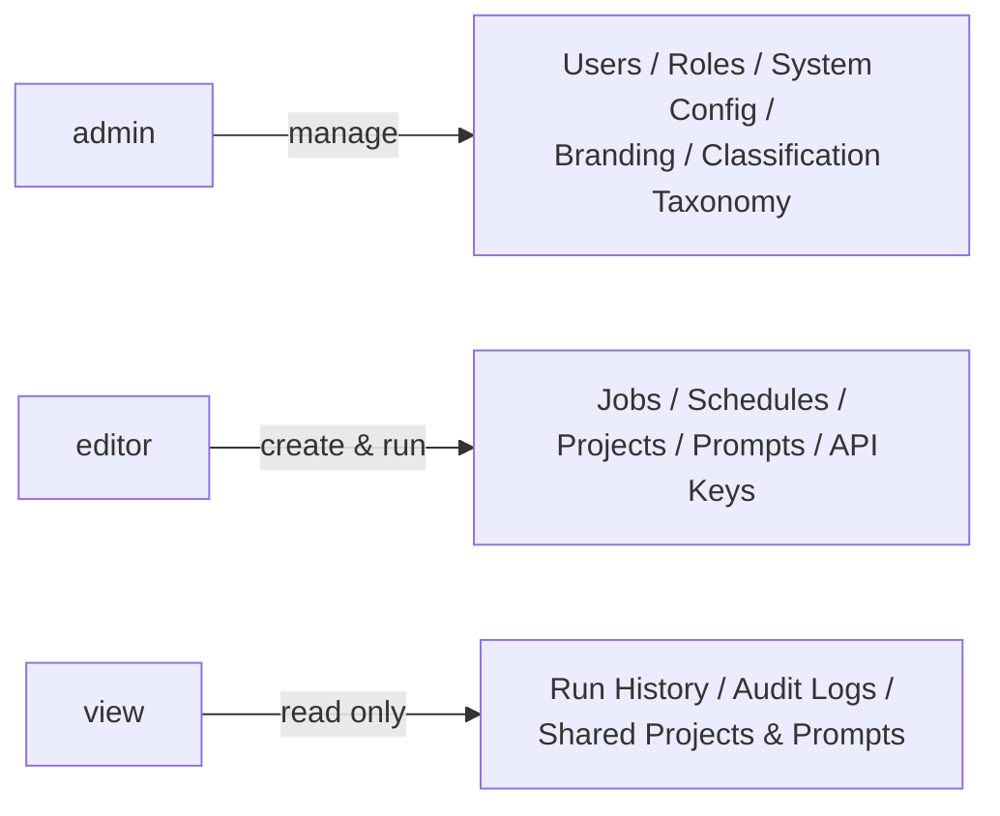

# Nexus Scheduler — Architecture

This document visualizes the system structure described in
[REQUIREMENTS.md](./REQUIREMENTS.md). It captures the working technical
direction (still draft, see REQUIREMENTS.md §11) as diagrams rather than
prose — the "why" behind each decision lives in REQUIREMENTS.md; this file
is the "what it looks like."

Diagrams are [Mermaid](https://mermaid.js.org/) and render natively on
GitHub/GitLab.

## 1. System Context

Who and what Nexus Scheduler talks to, at the boundary of the deployment.

Everything above the dotted line in later diagrams runs **inside** the
air-gapped Government network. LibreChat, Keycloak, SMTP, SIEM, and
webhook destinations are all internal services on that same network —
nothing here reaches the public internet at runtime (REQUIREMENTS.md §3).

## 2. Containers / Runtime Components

**Why API and Worker are separate containers**: the API serves interactive
UI traffic; the Worker runs due schedules concurrently and must scale
independently (horizontally, via replica count) as job volume grows,
without affecting UI responsiveness. Redis is the coordination point
between them — see REQUIREMENTS.md §2.1 and §11.

### Component responsibilities

| Component | Responsibility |
|---|---|
| Frontend (SPA) | Job/schedule/Project/Team UI, Prompt Library, admin settings, classification banner rendering |
| Backend API | AuthN/AuthZ (OIDC + local), CRUD for jobs/schedules/Projects/Teams/prompts, audit log access, approval queue, reporting endpoints, on-demand PDF download |
| Scheduler/Worker | Polls due schedules, enqueues/dequeues runs respecting concurrency limits, calls LibreChat, retries, computes cost, sends notifications/webhooks/emailed PDF reports, writes audit events |
| PDF Renderer | Shared HTML-to-PDF rendering capability (in-process library or internal call, no network egress) used by both API (on-demand download) and Worker (emailed reports) — REQUIREMENTS.md §2.5 |
| PostgreSQL | System of record: see §5 data model |
| Redis | Job queue + scheduling coordination across Worker replicas |
| nginx | TLS termination + reverse proxy (pre-existing in prod; included in Compose for local parity) |

## 3. Job Execution Flow

The core operational loop: a schedule fires, a job runs against LibreChat,
and the result is stored, audited, and optionally delivered.

## 4. Data Model (Illustrative)

Not a final schema — shows the key entities and relationships implied by
REQUIREMENTS.md (§2–§8).

Key fields worth calling out explicitly (full detail in REQUIREMENTS.md):

- `RUN`: `trigger_type` (scheduled/manual), `status`, `prompt_tokens`,
  `completion_tokens`, `computed_cost`, `output`, timing fields.
- `SCHEDULE`: `timezone` (IANA), `paused`, `approval_status`,
  `version_pin_mode` (pinned vs. always-latest).
- `AUDIT_EVENT`: see the proposed schema in REQUIREMENTS.md §7.1.

## 5. Deployment Topology — Kubernetes (Production)

- Images relocatable to an internal/offline registry (REQUIREMENTS.md §3).
- Runs in FIPS mode end to end (REQUIREMENTS.md §10).
- `/healthz` and `/metrics` on both Deployments (REQUIREMENTS.md §10, §11).

## 6. Deployment Topology — Docker Compose (Local Dev/Test)

- All secrets/keys **randomly generated at compose-up** (REQUIREMENTS.md
  §9.2) — no committed defaults.
- Exists purely to exercise Nexus Scheduler itself; does not attempt to
  simulate the air-gapped constraint.

## 7. Roles at a Glance

Full role/permission detail: REQUIREMENTS.md §4.

## 8. Open Items Affecting Architecture

These are tracked as open questions in REQUIREMENTS.md §14 but are called
out here because they affect the diagrams above once resolved:

- Whether PostgreSQL/Redis run as Helm subcharts or as externally-managed
  cluster services changes the boundary of the `ns` subgraph in §5.
- Confirming LibreChat's `usage` response shape affects the `RUN` entity
  in §4 (token fields).
